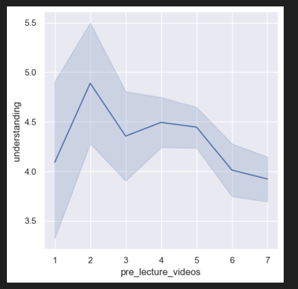
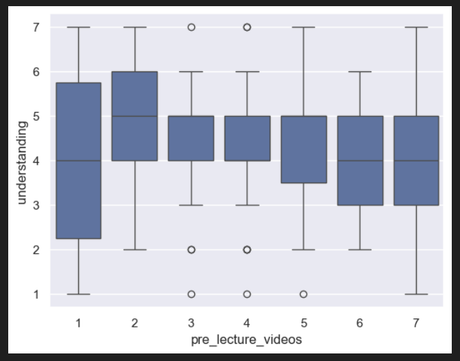
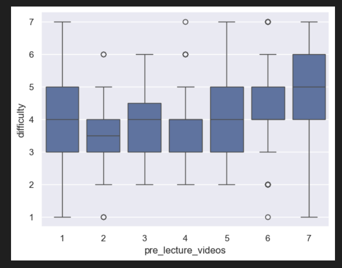

## Analysis

I analyzed the relationship between support for pre-lecture videos and student understanding, as well as perceived course difficulty.

### Visualization 1: Pre-Lecture Videos vs Understanding (Line Plot)

This visualization shows the average level of student understanding for each level of support for pre-lecture videos. I used a line plot to observe trends across the scale from low to high support.

From this graph, we can see that students who report lower understanding tend to show higher support for pre-lecture videos.

---

### Visualization 2: Pre-Lecture Videos vs Understanding (Box Plot)

This box plot shows the distribution of understanding values for each level of support for pre-lecture videos. This helps identify variability and median differences across groups.

The box plot reinforces the trend seen earlier: students with lower understanding ratings appear more frequently among those who strongly support pre-lecture videos.

---

### Visualization 3: Pre-Lecture Videos vs Difficulty (Box Plot)
th
This visualization explores whether students who support pre-lecture videos also perceive the course as more difficult.

This graph suggests that students who support pre-lecture videos tend to report slightly higher difficulty levels, indicating a possible relationship between struggling students and demand for additional resources.

---

## Conclusion
The analysis suggests that students who support the addition of pre-lecture videos tend to report lower understanding and slightly higher perceived difficulty in the course. This suggests that students who are struggling are more likely to want additional learning resources, like pre lecture videos in this situation.

Based on this, implementing optional pre-lecture videos could provide targeted support for students who need it most, potentially improving overall understanding without negatively affecting students who do not need extra help.

However, this analysis is just observational and doesn't actually prove causation. Other factors, like prior experience with coding or study habits, also might influence both understanding and support for pre-lecture videos. Future data collection could include direct feedback on the users' video usage or their performance outcomes to strengthen this analysis.

Overall, the data supports the idea that pre-lecture videos could be a valuable addition to the course.